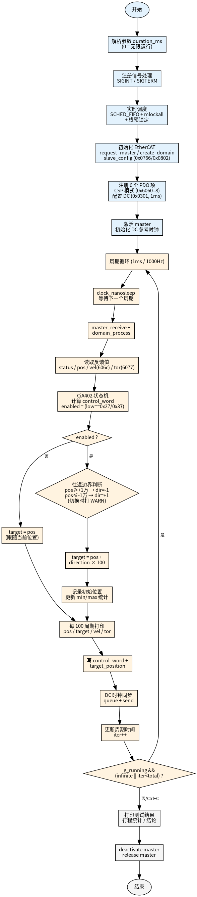

# motor_continuous 程序分析

> 针对 **Renesas EtherCAT RA8T2 CiA402 2port** 伺服驱动器（Vendor `0x00000766` / Product `0x00000802`）的电机持续转动测试程序。源码：`motor_continuous.cpp`。

## 1. 概述

`motor_continuous` 是一个**单线程实时 EtherCAT 主站程序**，使用 CSP（Cyclic Synchronous Position，周期同步位置）模式 + DC（Distributed Clock，分布式时钟）同步，让电机在固定区间内往返转动。

**通过 YAML 配置文件管理参数**（`Config/motor_continuous.yaml`），支持 **1~N 个从站**，每个从站独立的运动参数（步进量、往返边界）。新增/移除电机只需改配置文件，无需重新编译。

核心要素来自 `test_dc_scan` 实测验证过的配置（现均可在 YAML 调整）：
- DC 激活码 `0x0301`（Sync0 周期同步）
- 1ms 周期（1000Hz）
- CSP 模式（对象 `0x6060` = 8）
- 完整的 CiA402 状态机驱动

目标位置采用**往返策略**：每个从站在各自 `±travel_limit` 边界之间来回移动，每周期步进 `±step`。既能让电机持续转动，又避免位置计数器长时间运行后溢出（int32 上限约 ±21.4 亿）。

## 2. 程序流程图



程序分为三个阶段：**初始化（浅蓝）→ 主循环（浅橙）→ 清理（浅灰）**。流程图展示单个从站的执行流程；多从站时，主循环内的"读反馈→状态机→目标策略→写PDO"对每个从站依次执行一遍。

## 3. 详细分析

### 3.1 初始化阶段

| 步骤 | 说明 |
|------|------|
| 解析参数 | `duration_ms`（`0`=无限）+ 可选 `config_path` |
| 读取配置 | 加载 YAML → 全局参数 + 从站列表，失败则 fail loud 退出 |
| 注册信号 | `SIGINT` / `SIGTERM` → 置 `g_running = false`，优雅退出 |
| 实时调度 | `SCHED_FIFO` 最高优先级 + `mlockall` 锁内存 + 栈预锁定 |
| EtherCAT 初始化 | `request_master` / `create_domain` |
| 从站配置 | 遍历从站：`slave_config` + 注册 6 个 PDO + CSP 模式 + DC 配置 |
| PDO 注册 | 汇总所有从站的 PDO 项，一次性 `reg_pdo_entry_list` |
| 激活 | `ecrt_master_activate` + DC 参考时钟同步 |

**注册的 6 个 PDO 项**：

| 对象 | 含义 | 方向 | 位宽 |
|------|------|------|------|
| `0x607a` | Target Position 目标位置 | RxPDO（主→从） | 32 |
| `0x6040` | Control Word 控制字 | RxPDO | 16 |
| `0x6064` | Position Actual 实际位置 | TxPDO（从→主） | 32 |
| `0x6041` | Status Word 状态字 | TxPDO | 16 |
| `0x606c` | Velocity Actual 实际速度 | TxPDO | 32 |
| `0x6077` | Torque Actual 实际扭矩（单位 0.001 Nm） | TxPDO | 16 |

> 完整 PDO 映射见 `ethercat cstruct` 输出（csp RxPDO `0x1601` / csp TxPDO `0x1a01`），程序只用到上表 6 项。

### 3.2 主循环（1ms / 1000Hz）

每个周期固定执行（步骤 3~7 对**每个从站**依次执行一遍）：

1. **`clock_nanosleep`** 等待下一个绝对时间点（保证周期精度）
2. **接收处理**（全局一次）：`ecrt_master_receive` + `ecrt_domain_process`
3. **遍历从站** → 读反馈：status / pos / vel / tor
4. → **CiA402 状态机**：根据 status 低 6 位计算 control_word
5. → **目标策略**：计算 target（见 3.3，用该从站的 step / travel_limit）
6. → **打印**：每 `print_interval` 周期打印一行（带从站名）
7. → **写 PDO**：control_word + target_position
8. **DC 同步 + 发送**（全局一次）：`sync_reference_clock` / `sync_slave_clocks` / `queue` / `send`
9. **iter++**，更新下一周期时间

#### CiA402 状态机

根据 status word 的低 6 位（`status & 0x6f`）驱动状态转换：

| status 低6位 | 含义 | 输出 control_word |
|--------------|------|-------------------|
| `0x40` | Switch on disabled | `0x06`（Shutdown） |
| `0x21 / 0x23 / 0x33` | Ready / Switched on | `0x0F`（Enable operation） |
| `0x27 / 0x37` | Operation enabled | `0x0F` |
| fault（bit3=1） | 故障 | 交替 `0x80`/`0x06`（fault reset） |

**使能标志实时跟随**：`enabled = (low == 0x27 || low == 0x37)`。电机一旦掉出 Operation Enabled 状态（如从站掉到 SAFEOP），`enabled` 自动回退为 `false`，目标切换为跟随当前位置，避免往无效目标写入。

### 3.3 目标位置策略（往返）

```
未使能 (!enabled):
    target = pos                    // 跟随当前位置，不产生运动指令

已使能 (用该从站的 step / travel_limit):
    if pos >= +travel_limit: direction = -1   // 到达上限，反向
    if pos <= -travel_limit: direction = +1   // 到达下限，正向
    target = pos + direction * step           // 按当前方向步进
```

- **方向切换瞬间**打印一条 `[WARN]` 日志（用 `last_direction` 检测变化，避免刷屏）
- **行程统计**只在使能后记录：首次使能时记 `initial_pos`，之后持续更新 `min_pos`/`max_pos`

### 3.4 实时调度（关键）

CSP + DC 模式对周期精度要求极高。程序启用三重实时保障：

```cpp
sched_setscheduler(0, SCHED_FIFO, &sp);   // 1. FIFO 实时调度，最高优先级
mlockall(MCL_CURRENT | MCL_FUTURE);        // 2. 锁定内存，禁止换页
StackPrefault();                           // 3. 预先触发栈页错误
```

**为什么必须 sudo**：`SCHED_FIFO` 需要 `CAP_SYS_NICE` 权限。非 root 运行时 `sched_setscheduler` 失败，周期会被普通调度抢占产生抖动，从站收不到及时周期数据，**watchdog 超时后会从 OP 掉到 SAFEOP / PREOP / INIT**。

### 3.5 清理阶段

退出循环后（超时 / Ctrl+C）：
1. 打印测试结果（行程统计、结论）
2. `ecrt_master_deactivate`
3. `ecrt_release_master`

## 4. 打印格式

每个周期（按 `print_interval`）每个从站各打印一行：
```
[motor_0] [t= 100ms] AL=OP Status=[Rdy On Ena Vol] pos=9976 target=10076 vel=120 tor=15 ↑
```

| 字段 | 含义 |
|------|------|
| `[motor_0]` | 从站名称（YAML 里的 `name`） |
| `AL` | EtherCAT 从站状态：INIT / PREOP / SAFEOP / OP |
| `Status` | CiA402 状态位：`Rdy` `On` `Ena` `Flt` `Vol` `Dis` `Tgt` `Ign` |
| `pos` | 当前位置（`0x6064`） |
| `target` | 目标位置（pos ± step） |
| `vel` | 实际速度（`0x606c`） |
| `tor` | 实际扭矩（`0x6077`，单位 0.001 Nm） |
| `↑/↓` | 当前移动方向 |

## 5. 已知现象与注意事项

### Ign（bit12 = Ignoring Target）
运行中常出现 `Status=[... Ign]`，表示 CSP 模式**忽略了目标位置**。常见原因：
- 目标位置超出软件限位（`0x607D`）
- 跟随误差超出窗口（`0x6065`）
- 目标速度超过最大速度（`0x6080`）

每周期 `+100` 对应 100000 单位/秒的目标速度，可能超过驱动器限制导致目标被忽略，电机实际移动远慢于目标。这是功能正常但速度受限的表现，不影响往返逻辑。

### 从站掉状态
若运行中 AL 在 OP/SAFEOP/PREOP/INIT 之间跳变，说明**周期不稳定**，请确认：
- 用 `sudo` 运行（启用 SCHED_FIFO）
- 系统负载不高
- 内核为 PREEMPT_RT（推荐）

## 6. 文件清单

| 文件 | 说明 |
|------|------|
| `motor_continuous.cpp` | 程序源码 |
| `Config/motor_continuous.yaml` | YAML 配置文件（参数 + 从站列表） |
| `Document/flowchart.dot` | 流程图 Graphviz 源文件 |
| `Document/flowchart.png` | 流程图渲染图片 |
| `readme.md` | 编译/运行说明 |
| `Document/motor_continuous_ANALYSIS.md` | 本分析文档 |
