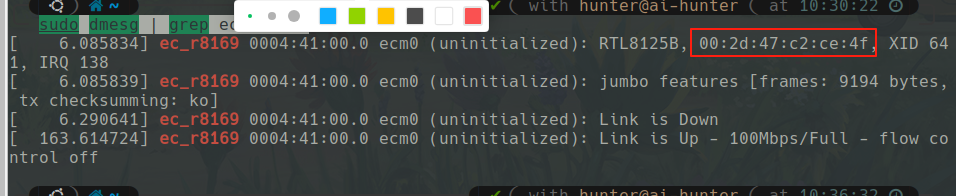

# AI Hunter Ethercat Demo
## Install Driver and Application
### Add My Private APT Repository  
```bash
cat << 'EOF' | sudo tee /etc/apt/sources.list.d/kaylordut.list 
deb [arch=arm64 signed-by=/etc/apt/keyrings/kaylor-keyring.gpg] http://apt.kaylordut.cn/kaylordut/ kaylordut main
EOF
sudo mkdir /etc/apt/keyrings -pv
sudo wget -O /etc/apt/keyrings/kaylor-keyring.gpg http://apt.kaylordut.cn/kaylor-keyring.gpg
sudo apt update
```
### Check Kernel Version and Install Driver
```bash
╰─ uname -a                                                                                                                                ─╯
Linux ai-hunter 6.1.43-rt14-rockchip-rk3588 #1.0.0 SMP PREEMPT_RT Fri Jul 25 16:37:54 CST 2025 aarch64 aarch64 aarch64 GNU/Linux

╰─ apt policy ethercat-module                                                                                                              ─╯
ethercat-module:
  Installed: (none)
  Candidate: 6.1.43-rt14-rockchip-rk3588
  Version table:
     6.1.43-rt14-rockchip-rk3588 500
        500 http://apt.kaylordut.cn/kaylordut kaylordut/main arm64 Packages
     5.10.160-rt89-rockchip-rk3588 500
        500 http://apt.kaylordut.cn/kaylordut kaylordut/main arm64 Packages
```
```bash
# !!!!!
sudo apt install -y ethercat-module=6.1.43-rt14-rockchip-rk3588 # if kernel version is 6.1.43-rt14-rockchip-rk3588
# !!!!!
sudo apt install -y ethercat-module=5.10.160-rt89-rockchip-rk3588 # if kernel vesion is 5.10.160-rt89-rockchip-rk3588
```
> Pls notice kernel version 

### Install Application
```bash
sudo apt install -y ethercat-master
```

## Configure Ethercat Port
### Test EC Driver
```bash
sudo modprobe r8169 # remove normal driver
sudo modprobe ec_r8169 # add ec driver
```
### Get Port Information
```bash
sudo dmesg | grep ec_r8169 
```
  
> copy the mac address

### Edit config
Edit /etc/ethercat.conf
```conf
MASTER0_DEVICE="00:2d:47:c2:ce:4f"
DEVICE_MODULES="r8169"
UPDOWN_INTERFACES=""
```

## Ethercat状态信息

```bash
╰─ ethercat cstruct                                                                                                                        ─╯
/* Master 0, Slave 0, "ioSample"
 * Vendor ID:       0x00300077
 * Product code:    0x00000001
 * Revision number: 0x00000001
 */

ec_pdo_entry_info_t slave_0_pdo_entries[] = {
    {0x7000, 0x01, 1}, /* OUTPUT_BIT1 */
    {0x7000, 0x02, 1}, /* OUTPUT_BIT2 */
    {0x0000, 0x00, 6}, /* Gap */
    {0x6000, 0x01, 1}, /* ININPUT_BIT1 */
    {0x6000, 0x02, 1}, /* ININPUT_BIT2 */
    {0x0000, 0x00, 6}, /* Gap */
};

ec_pdo_info_t slave_0_pdos[] = {
    {0x1600, 3, slave_0_pdo_entries + 0}, /* OUTPUT process data mapping */
    {0x1a00, 3, slave_0_pdo_entries + 3}, /* INPUT process data mapping */
};

ec_sync_info_t slave_0_syncs[] = {
    {0, EC_DIR_OUTPUT, 0, NULL, EC_WD_DISABLE},
    {1, EC_DIR_INPUT, 0, NULL, EC_WD_DISABLE},
    {2, EC_DIR_OUTPUT, 1, slave_0_pdos + 0, EC_WD_ENABLE},
    {3, EC_DIR_INPUT, 1, slave_0_pdos + 1, EC_WD_DISABLE},
    {0xff}
};

/* Master 0, Slave 1, "ZeroErr Driver"
 * Vendor ID:       0x5a65726f
 * Product code:    0x00029252
 * Revision number: 0x00000001
 */

ec_pdo_entry_info_t slave_1_pdo_entries[] = {
    {0x607a, 0x00, 32}, /* Target Position */
    {0x60fe, 0x00, 32}, /* Digital outputs */
    {0x6040, 0x00, 16}, /* Control Word */
    {0x6064, 0x00, 32}, /* Position Actual Value */
    {0x60fd, 0x00, 32}, /* Digital inputs */
    {0x6041, 0x00, 16}, /* Status Word */
};

ec_pdo_info_t slave_1_pdos[] = {
    {0x1600, 3, slave_1_pdo_entries + 0}, /* R0PDO */
    {0x1a00, 3, slave_1_pdo_entries + 3}, /* T0PDO */
};

ec_sync_info_t slave_1_syncs[] = {
    {0, EC_DIR_OUTPUT, 0, NULL, EC_WD_DISABLE},
    {1, EC_DIR_INPUT, 0, NULL, EC_WD_DISABLE},
    {2, EC_DIR_OUTPUT, 1, slave_1_pdos + 0, EC_WD_ENABLE},
    {3, EC_DIR_INPUT, 1, slave_1_pdos + 1, EC_WD_DISABLE},
    {0xff}
};


╰─ ethercat slaves                                                                                                                         ─╯
0  0:0  PREOP  +  ioSample
1  0:1  PREOP  +  ZeroErr Driver

```
> 从上面打印信息看到 MCU的 别名是0， 位置是0， ZeroErr的 别名是0 ， 位置是1
> 同时注意PDO的映射信息

# Ethercat Command
```angular2html
# 🧩 EtherCAT 命令行工具速查手册

> 基于 IgH EtherCAT Master v1.6.8 官方文档整理  
> 命令格式：
> ```bash
> ethercat <command> [OPTIONS] [ARGUMENTS]
```


## ⚙️ 基础操作命令

| 命令 | 功能说明 | 示例 |
|------|-----------|------|
| `ethercat master` | 显示主站及网络设备信息 | `ethercat master` |
| `ethercat version` | 显示主站软件版本号 | `ethercat version` |
| `ethercat states <STATE>` | 设置从站的应用层状态（INIT / PREOP / SAFEOP / OP） | `ethercat states OP` |
| `ethercat rescan` | 重新扫描总线，更新从站信息 | `ethercat rescan` |
| `ethercat debug <LEVEL>` | 设置主站调试级别（0~2） | `ethercat debug 2` |

---

## 🧭 从站与总线信息查询

| 命令 | 功能说明 | 示例 |
|------|-----------|------|
| `ethercat slaves` | 显示当前总线上所有从站及其状态 | `ethercat slaves` |
| `ethercat alias [OPTIONS] <ALIAS>` | 读写从站的别名地址 | `ethercat alias -p0 0x2000` |
| `ethercat config [OPTIONS]` | 显示从站配置、PDO、SDO 信息 | `ethercat config -v` |
| `ethercat domains` | 显示所有 Domain 信息（含工作计数器） | `ethercat domains` |
| `ethercat graph` | 生成 EtherCAT 拓扑图（Graphviz 格式） | `ethercat graph | dot -Tsvg > bus.svg` |

---

## 🧰 数据访问与调试命令

| 命令 | 功能说明 | 示例 |
|------|-----------|------|
| `ethercat data` | 输出当前过程数据（PDO 域） | `ethercat data -d0` |
| `ethercat crc [reset]` | 显示或复位 CRC 错误计数 | `ethercat crc` |
| `ethercat pdos` | 列出从站的 PDO 映射和分配信息 | `ethercat pdos` |
| `ethercat cstruct` | 生成 C 语言格式的 PDO 定义结构 | `ethercat cstruct > pdo_map.h` |
| `ethercat sdos` | 列出从站的 SDO 字典（索引、类型、权限） | `ethercat sdos -p0` |
| `ethercat sii_read` | 读取 SII（EEPROM）内容 | `ethercat sii_read -p0` |
| `ethercat reg_read` / `ethercat reg_write` | 读写从站寄存器（支持多种数据类型） | `ethercat reg_read -p0 0x1200 4` |

---

## 📦 通信协议操作命令

| 协议 | 命令 | 功能说明 | 示例 |
|------|------|-----------|------|
| **CoE (SDO)** | `ethercat upload <INDEX> <SUBINDEX>` | 从从站读取 SDO | `ethercat upload -p0 0x6061 0` |
|  | `ethercat download <INDEX> <SUBINDEX> <VALUE>` | 向从站写入 SDO | `ethercat download -p0 0x6060 0 1` |
| **SoE** | `ethercat soe_read <IDN>` / `soe_write <IDN> <VALUE>` | 读取或写入驱动参数（IEC 61800-7） | `ethercat soe_read -p0 0x1234` |
| **FoE** | `ethercat foe_read <SOURCEFILE>` / `foe_write <FILENAME>` | 文件传输（读/写固件） | `ethercat foe_write -p0 firmware.bin` |
| **EoE** | `ethercat eoe` | 显示 EoE 状态统计 | `ethercat eoe` |
| **EoE 网络配置** | `ethercat ip [OPTIONS]` | 设置从站的 IP/MAC/DNS 等参数 | `ethercat ip -p0 192.168.1.10` |

---

## 🧩 高级工具命令

| 命令 | 功能说明 | 示例 |
|------|-----------|------|
| `ethercat sdos --quiet` | 仅显示对象，不显示条目 | `ethercat sdos --quiet` |
| `ethercat sdos --alias <ALIAS>` | 按别名筛选从站显示 | `ethercat sdos --alias 0x2000` |
| `ethercat soe_read / soe_write` | SoE 对象访问（伺服驱动配置） | `ethercat soe_read -p0 1 0x1234` |
| `ethercat xml` | 生成从站描述 XML 文件（ESI） | `ethercat xml > slave.xml` |
| `ethercat states` | 改变从站状态 | `ethercat states SAFEOP` |

---

## 📊 常用操作示例

```bash
# 查看所有从站
ethercat slaves

# 查看主站和设备信息
ethercat master

# 设置主站调试级别为最高
ethercat debug 2

# 写入从站 SDO 0x6060 子索引0 值为1（操作模式）
ethercat download -p0 0x6060 0 1

# 读取寄存器地址 0x1200 内容
ethercat reg_read -p0 0x1200 4

# 导出总线拓扑图
ethercat graph | dot -Tsvg > bus.svg

```